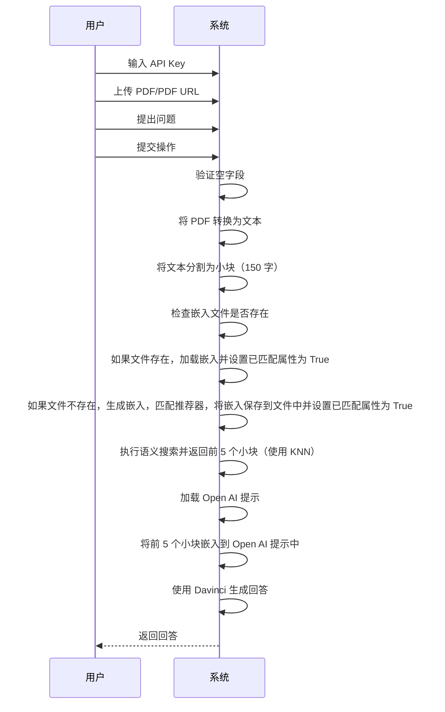
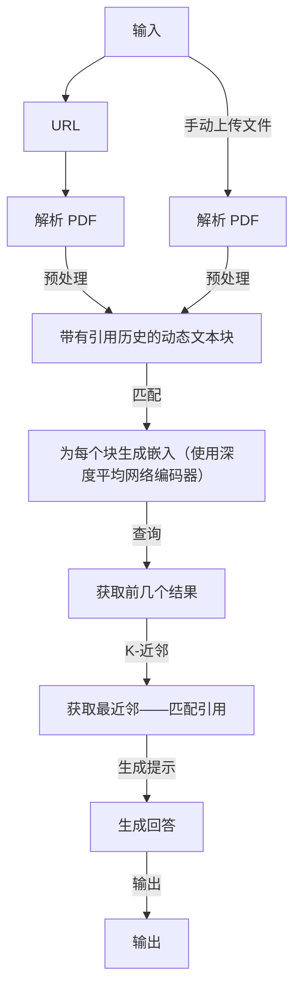

# pdfGPT
## 演示
1. **演示网址**: https://bhaskartripathi-pdfgpt-turbo.hf.space
2. **演示视频**:

   [](https://www.youtube.com/watch?v=LzPgmmqpBk8)

#### 版本更新（2023年7月27日）：
1. 改进了错误处理机制
2. PDF GPT 现在支持 Turbo 模型和 GPT-4，包括 16K 和 32K token 模型
3. 增加了预定义问题，用于自动填充输入框
4. 实现了聊天历史功能


### 关于模型性能的说明
```如果在使用 Turbo 模型时，发现某个具体问题的回答效果不好，需要理解 Turbo 模型（例如 gpt-3.5-turbo）是用于聊天完成的模型，在嵌入相似度较低时可能无法给出理想回答。尽管 OpenAI 声称 Turbo 模型表现优异，但它并不是最适合问答的模型。在这种情况下，建议使用经典的 text-DaVinci-003 或者 GPT-4 及以上的模型，它们通常能提供更相关的答案。```

# 即将推出的更新计划：
1. 支持 Falcon、Vicuna、Meta Llama
2. 增加 OCR 支持
3. 支持多个 PDF 文件
4. Node.js 版 Web 应用程序——无需试用、无 API 费用，100% 开源

### 问题描述：
1. 当传递较大文本给 OpenAI 时，受限于 4K token 限制，无法将整个 PDF 文件作为输入。
2. OpenAI 有时会显得过于“健谈”，返回与查询无关的答案，这是因为其使用的嵌入效果较差。
3. ChatGPT 无法直接访问外部数据，一些解决方案使用 Langchain，但如果没有正确实现，它非常消耗 token。
4. 像 https://www.chatpdf.com, https://www.bespacific.com/chat-with-any-pdf, https://www.filechat.io 这类解决方案内容质量较差，容易出现“幻觉问题”。为了解决这个问题，我建议使用 Universal Sentence Encoder 系列算法来改进嵌入（了解更多: https://tfhub.dev/google/collections/universal-sentence-encoder/1）。

### 解决方案：什么是 PDF GPT？
1. PDF GPT 允许用户通过 GPT 功能与上传的 PDF 文件进行对话。
2. 应用程序会智能地将文档分割为较小的片段，并使用深度平均网络编码器生成嵌入。
3. 首先对 PDF 内容进行语义搜索，将最相关的嵌入传递给 OpenAI。
4. 使用自定义逻辑生成准确的回答。返回的回答可以引用信息所在的页码（用方括号 [ ] 标注），增加了回答的可信度，并帮助快速找到相关信息。相比于 OpenAI 的普通回答，返回的结果更为精确。
5. Andrej Karpathy 在这篇帖子中提到，KNN 算法非常适合处理类似问题：https://twitter.com/karpathy/status/1647025230546886658

### Docker 部署
运行 `docker-compose -f docker-compose.yaml up` 即可通过 Docker compose 使用。

## 在生产环境中使用 `pdfGPT` [langchain-serve](https://github.com/jina-ai/langchain-serve)

#### 本地体验
1. 在一个终端中运行 `lc-serve deploy local api` 来使用 langchain-serve 将应用程序暴露为 API。
2. 在另一个终端中运行 `python app.py` 来启动本地的 gradio playground。
3. 打开浏览器访问 `http://localhost:7860` 并与应用程序交互。

`lc-serve deploy jcloud api` 

<details>
<summary>显示命令输出</summary>

```text
╭──────────────┬──────────────────────────────────────────────────────────────────────────────────────╮
│ App ID       │                                 langchain-3ff4ab2c9d                                 │
├──────────────┼──────────────────────────────────────────────────────────────────────────────────────┤
│ Phase        │                                       Serving                                        │
├──────────────┼──────────────────────────────────────────────────────────────────────────────────────┤
│ Endpoint     │                      https://langchain-3ff4ab2c9d.wolf.jina.ai                       │
├──────────────┼──────────────────────────────────────────────────────────────────────────────────────┤
│ App logs     │                               dashboards.wolf.jina.ai                                │
├──────────────┼──────────────────────────────────────────────────────────────────────────────────────┤
│ Swagger UI   │                    https://langchain-3ff4ab2c9d.wolf.jina.ai/docs                    │
├──────────────┼──────────────────────────────────────────────────────────────────────────────────────┤
│ OpenAPI JSON │                https://langchain-3ff4ab2c9d.wolf.jina.ai/openapi.json                │
╰──────────────┴──────────────────────────────────────────────────────────────────────────────────────╯
```

</details>

#### 使用 cURL 进行交互

（将 URL 更改为您的端点）

**PDF URL**
```bash
curl -X 'POST' \
  'https://langchain-3ff4ab2c9d.wolf.jina.ai/ask_url' \
  -H 'accept: application/json' \
  -H 'Content-Type: application/json' \
  -d '{
  "url": "https://uiic.co.in/sites/default/files/uploads/downloadcenter/Arogya%20Sanjeevani%20Policy%20CIS_2.pdf",
  "question": "房间租金的上限是多少？",
  "envs": {
    "OPENAI_API_KEY": "'"${OPENAI_API_KEY}"'"
    }
}'

{"result":"房租每天最高为 5,000 印度卢比，详见 Arogya Sanjeevani Policy [页码 1]。","error":"","stdout":""}
```

**PDF 文件**
```bash
QPARAMS=$(echo -n 'input_data='$(echo -n '{"question": "房间租金的上限是多少？", "envs": {"OPENAI_API_KEY": "'"${OPENAI_API_KEY}"'"}}' | jq -s -R -r @uri))
curl -X 'POST' \
  'https://langchain-3ff4ab2c9d.wolf.jina.ai/ask_file?'"${QPARAMS}" \
  -H 'accept: application/json' \
  -H 'Content-Type: multipart/form-data' \
  -F 'file=@Arogya_Sanjeevani_Policy_CIS_2.pdf;type=application/pdf'

{"result":"房租每天最高为 5,000 印度卢比，详见 Arogya Sanjeevani Policy [页码 1]。","error":"","stdout":""}
```

## 在本地运行
### 致谢：[Adithya S](https://github.com/200901002)
1. 在终端或命令提示符中输入以下命令以拉取镜像：
```bash
docker pull registry.hf.space/bhaskartripathi-pdfchatter:latest
```
2. 将 Universal Sentence Encoder 下载到项目根目录。本地下载非常重要，否则每次运行时都会下载 915 MB。
3. 使用此 [链接](https://tfhub.dev/google/universal-sentence-encoder/4?tf-hub-format=compressed) 下载编码器。
4. 解压下载的文件并将其放入项目根目录，如下所示：
```text
项目根目录
└───Universal Sentence Encoder
|   ├───assets
|   └───variables
|   └───saved_model.pb
|
└───app.py
```
5. 如果已下载编码器，请将 API 文件第 68 行代码替换为：
```python
self.use = hub.load('https://tfhub.dev/google/universal-sentence-encoder/4')
```
替换为：
```python
self.use = hub.load('./Universal Sentence Encoder/')
```
6. 现在，运行 PDF-GPT，输入以下命令：

```bash
docker run -it -p 7860:7860 --platform=linux/amd64 registry.hf.space/bhaskartripathi-pdfchatter:latest python app.py
```
### **无集成的原始源代码**（用于 Hugging Face 上的演示）：
https://huggingface.co/spaces/bhaskartripathi/pdfGPT_Turbo

## UML 图


### 流程图


## Star History

[](https://star-history.com/#bhaskatripathi/pdfGPT&Date)
我正在寻找更多来自开源社区的贡献者，可以自愿承担待办事项并与我共同维护这个应用程序。

## 试试 PyViralContent：
有没有想过为什么你的社交媒体帖子、博客、文章、广告、YouTube 视频或其他内容没有火起来？
我发布了一个新的 Python 包：pyviralcontent ！🚀
它可以预测你的内容的传播性以及可读性得分！它使用多种复杂算法计算内容的可读性得分，并使用多标准决策分析预测内容的传播概率。📈 让你的内容策略数据驱动！试试它，把你的内容影响力提升到新的高度！💥
https://github.com/bhaskatripathi/pyviralcontent